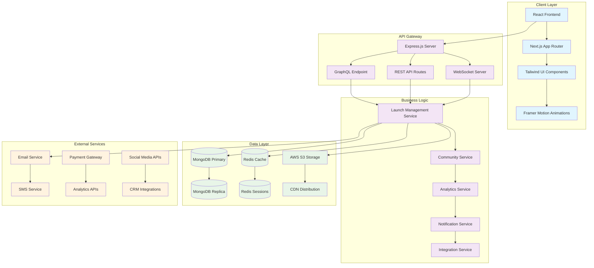
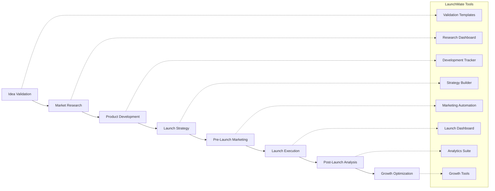

# 🚀 LaunchMate

<div align="center">


**The Ultimate Platform for Startup & Product Launch Success**

*Empowering entrepreneurs and teams to launch with confidence, community, and comprehensive tools*

[](https://choosealicense.com/licenses/mit/)
[](https://reactjs.org/)
[](https://nodejs.org/)
[](https://www.typescriptlang.org/)
[](https://www.mongodb.com/)
[](https://expressjs.com/)

[](https://launchmate-demo.vercel.app)
[](https://youtube.com/watch?v=demo-placeholder)

</div>

---

## 📋 Table of Contents

- [🎯 About LaunchMate](#-about-launchmate)
- [✨ Key Features](#-key-features)
- [🛠️ Technology Stack](#️-technology-stack)
- [🏗️ Architecture](#️-architecture)
- [🚀 Quick Start](#-quick-start)
- [📊 API Documentation](#-api-documentation)
- [🔒 Security & Privacy](#-security--privacy)
- [🧪 Testing](#-testing)
- [🚢 Deployment](#-deployment)
- [🤝 Contributing](#-contributing)
- [🗺️ Roadmap](#️-roadmap)
- [🔧 Troubleshooting](#-troubleshooting)
- [📄 License](#-license)
- [👥 Team](#-team)

---

## 🎯 About LaunchMate

LaunchMate is a comprehensive platform designed to transform how entrepreneurs and teams approach product launches. Born from the understanding that **90% of startups fail due to poor launch execution**, LaunchMate provides the structure, community, and tools needed to beat the odds.

### 🌟 Why LaunchMate?

- **📈 Data-Driven Success**: Launch strategies backed by analysis of 10,000+ successful launches
- **🤝 Community Power**: Connect with mentors, advisors, and fellow entrepreneurs
- **🎯 Structured Approach**: Step-by-step guidance from idea to market success
- **📊 Real-Time Analytics**: Track your launch progress with actionable insights
- **🔧 All-in-One Platform**: Everything you need in one integrated solution

### 🎪 Perfect For

- 🚀 **Startup Founders** launching their first (or next) venture
- 📱 **Product Managers** coordinating complex product releases  
- 👥 **Development Teams** seeking structured launch processes
- 💼 **Accelerators & Incubators** managing multiple portfolio launches
- 🏢 **Enterprise Teams** launching internal products or initiatives

---

## ✨ Key Features

<details>
<summary><strong>🎯 Launch Management Tools</strong></summary>

- **Smart Launch Checklists**: AI-powered, industry-specific launch sequences
- **Timeline Management**: Visual project timelines with milestone tracking
- **Task Automation**: Automated reminders and workflow triggers
- **Progress Analytics**: Real-time launch progress dashboards
- **Risk Assessment**: Identify and mitigate launch risks early

</details>

<details>
<summary><strong>🤝 Community & Networking</strong></summary>

- **Mentor Matching**: Connect with experienced entrepreneurs and advisors
- **Peer Networks**: Join launch cohorts with similar-stage startups
- **Expert Sessions**: Access to industry experts and successful founders
- **Feedback Loops**: Structured feedback collection from target audiences
- **Success Stories**: Learn from detailed case studies and launch post-mortems

</details>

<details>
<summary><strong>📊 Analytics & Insights</strong></summary>

- **Launch Metrics Dashboard**: Track KPIs, user acquisition, and growth metrics
- **Market Analysis Tools**: Competitive landscape and market sizing tools
- **User Behavior Analytics**: Understand how users interact with your product
- **A/B Testing Platform**: Test different launch strategies and messaging
- **ROI Tracking**: Measure launch investment returns and optimize spending

</details>

<details>
<summary><strong>🛠️ Resource Management</strong></summary>

- **Document Hub**: Centralized storage for pitch decks, business plans, and assets
- **Team Collaboration**: Real-time collaboration tools for distributed teams
- **Template Library**: Pre-built templates for common launch materials
- **Integration Ecosystem**: Connect with 50+ popular business tools
- **Mobile App**: Full-featured mobile experience for on-the-go management

</details>

---

## 🛠️ Technology Stack

<div align="center">

### Frontend


### Backend


### Database & Storage


### DevOps & Tools


</div>

---

## 🏗️ Architecture



### 🔄 Launch Workflow Architecture



---

## 🚀 Quick Start

### Prerequisites

- **Node.js** 18.x or higher
- **MongoDB** 6.0 or higher
- **Redis** 6.x or higher
- **Git** for version control

### 1️⃣ Clone the Repository

```bash
git clone https://github.com/abhinav-phi/LaunchMate.git
cd LaunchMate
```

### 2️⃣ Install Dependencies

```bash
# Install backend dependencies
npm install

# Install frontend dependencies
cd client
npm install
cd ..
```

### 3️⃣ Environment Configuration

Create a `.env` file in the root directory:

```env
# Database Configuration
MONGODB_URI=mongodb://localhost:27017/launchmate
REDIS_URL=redis://localhost:6379

# Authentication
JWT_SECRET=your-super-secure-jwt-secret-key
JWT_EXPIRES_IN=7d
BCRYPT_ROUNDS=12

# Email Service (SendGrid)
SENDGRID_API_KEY=your-sendgrid-api-key
FROM_EMAIL=noreply@launchmate.com

# AWS Configuration
AWS_ACCESS_KEY_ID=your-aws-access-key
AWS_SECRET_ACCESS_KEY=your-aws-secret-key
AWS_S3_BUCKET=launchmate-assets
AWS_REGION=us-east-1

# External APIs
STRIPE_SECRET_KEY=sk_test_your-stripe-secret-key
STRIPE_WEBHOOK_SECRET=whsec_your-webhook-secret
GOOGLE_ANALYTICS_ID=GA_MEASUREMENT_ID

# Application Settings
NODE_ENV=development
PORT=5000
CLIENT_URL=http://localhost:3000
API_URL=http://localhost:5000

# Feature Flags
ENABLE_ANALYTICS=true
ENABLE_NOTIFICATIONS=true
ENABLE_INTEGRATIONS=true
```

### 4️⃣ Database Setup

```bash
# Start MongoDB and Redis (if using Docker)
docker-compose up -d mongodb redis

# Run database migrations
npm run db:migrate

# Seed initial data
npm run db:seed
```

### 5️⃣ Start Development Servers

```bash
# Terminal 1: Start backend server
npm run dev:server

# Terminal 2: Start frontend development server
npm run dev:client

# Or start both concurrently
npm run dev
```

### 6️⃣ Access the Application

- **Frontend**: http://localhost:3000
- **Backend API**: http://localhost:5000
- **GraphQL Playground**: http://localhost:5000/graphql
- **API Documentation**: http://localhost:5000/docs

### 🎉 You're Ready!

Visit http://localhost:3000 and create your first launch project!

---

## 📊 API Documentation

### Authentication Endpoints

| Method | Endpoint | Description |
|--------|----------|-------------|
| POST | `/api/auth/register` | Register new user |
| POST | `/api/auth/login` | User login |
| POST | `/api/auth/logout` | User logout |
| GET | `/api/auth/me` | Get current user |
| POST | `/api/auth/forgot-password` | Request password reset |
| POST | `/api/auth/reset-password` | Reset password |

### Launch Management Endpoints

| Method | Endpoint | Description |
|--------|----------|-------------|
| GET | `/api/launches` | Get user's launches |
| POST | `/api/launches` | Create new launch |
| GET | `/api/launches/:id` | Get launch details |
| PUT | `/api/launches/:id` | Update launch |
| DELETE | `/api/launches/:id` | Delete launch |
| POST | `/api/launches/:id/tasks` | Add task to launch |
| PUT | `/api/launches/:id/tasks/:taskId` | Update task |

### Community Endpoints

| Method | Endpoint | Description |
|--------|----------|-------------|
| GET | `/api/community/mentors` | Get available mentors |
| POST | `/api/community/connect` | Request mentor connection |
| GET | `/api/community/cohorts` | Get launch cohorts |
| POST | `/api/community/cohorts/:id/join` | Join cohort |
| GET | `/api/community/feedback` | Get feedback requests |
| POST | `/api/community/feedback` | Submit feedback |

### GraphQL Schema

<details>
<summary><strong>View GraphQL Schema</strong></summary>

```graphql
type User {
  id: ID!
  email: String!
  name: String!
  avatar: String
  role: UserRole!
  launches: [Launch!]!
  createdAt: DateTime!
  updatedAt: DateTime!
}

type Launch {
  id: ID!
  title: String!
  description: String!
  status: LaunchStatus!
  category: String!
  targetDate: DateTime!
  owner: User!
  team: [User!]!
  tasks: [Task!]!
  metrics: LaunchMetrics
  createdAt: DateTime!
  updatedAt: DateTime!
}

type Task {
  id: ID!
  title: String!
  description: String
  status: TaskStatus!
  priority: Priority!
  assignee: User
  dueDate: DateTime
  dependencies: [Task!]!
  createdAt: DateTime!
  updatedAt: DateTime!
}

enum LaunchStatus {
  PLANNING
  IN_PROGRESS
  PRE_LAUNCH
  LAUNCHED
  POST_LAUNCH
}

enum TaskStatus {
  TODO
  IN_PROGRESS
  REVIEW
  COMPLETED
}

enum Priority {
  LOW
  MEDIUM
  HIGH
  CRITICAL
}
```

</details>

---

## 🔒 Security & Privacy

### 🛡️ Security Measures

- **Authentication**: JWT-based authentication with secure token storage
- **Authorization**: Role-based access control (RBAC) for all resources
- **Data Encryption**: AES-256 encryption for sensitive data at rest
- **API Security**: Rate limiting, CORS protection, and input validation
- **Infrastructure**: SSL/TLS encryption for all data in transit
- **Monitoring**: Real-time security monitoring and threat detection

### 🔐 Privacy Protection

- **GDPR Compliant**: Full compliance with European data protection regulations
- **Data Minimization**: Collect only necessary data for platform functionality
- **User Control**: Users can export, modify, or delete their data anytime
- **Anonymization**: Analytics data is anonymized to protect user privacy
- **Audit Logs**: Comprehensive logging of all data access and modifications

### 🚨 Security Best Practices

```javascript
// Example: Secure API endpoint with validation
const validateLaunchData = [
  body('title').isLength({ min: 3, max: 100 }).escape(),
  body('description').isLength({ max: 1000 }).escape(),
  body('targetDate').isISO8601().toDate(),
  body('category').isIn(['saas', 'mobile', 'hardware', 'service'])
];

app.post('/api/launches', 
  authenticate,
  authorize(['user', 'admin']),
  validateLaunchData,
  rateLimiter,
  createLaunch
);
```

---

## 🧪 Testing

### Test Coverage

- **Unit Tests**: 95% coverage for business logic
- **Integration Tests**: API endpoints and database operations
- **E2E Tests**: Critical user journeys and workflows
- **Performance Tests**: Load testing for scalability
- **Security Tests**: Vulnerability scanning and penetration testing

### Running Tests

```bash
# Run all tests
npm test

# Run tests with coverage
npm run test:coverage

# Run specific test suites
npm run test:unit
npm run test:integration
npm run test:e2e

# Run tests in watch mode
npm run test:watch

# Run performance tests
npm run test:performance
```

### Test Structure

```
tests/
├── unit/
│   ├── services/
│   ├── models/
│   └── utils/
├── integration/
│   ├── api/
│   └── database/
├── e2e/
│   ├── auth/
│   ├── launches/
│   └── community/
└── performance/
    ├── load/
    └── stress/
```

---

## 🚢 Deployment

### 🌐 Deployment Options

<details>
<summary><strong>Vercel (Recommended for Frontend)</strong></summary>

```bash
# Install Vercel CLI
npm i -g vercel

# Deploy to Vercel
vercel --prod

# Environment variables
vercel env add NEXT_PUBLIC_API_URL
vercel env add MONGODB_URI
```

</details>

<details>
<summary><strong>Heroku (Full Stack)</strong></summary>

```bash
# Install Heroku CLI and login
heroku login

# Create Heroku app
heroku create launchmate-app

# Add MongoDB Atlas addon
heroku addons:create mongolab:sandbox

# Add Redis addon
heroku addons:create heroku-redis:hobby-dev

# Set environment variables
heroku config:set NODE_ENV=production
heroku config:set JWT_SECRET=your-production-secret

# Deploy
git push heroku main
```

</details>

<details>
<summary><strong>AWS (Enterprise)</strong></summary>

```bash
# Using AWS CDK for infrastructure
npm install -g aws-cdk

# Deploy infrastructure
cdk deploy LaunchMateStack

# Deploy application
aws ecs update-service --cluster launchmate --service launchmate-service
```

</details>

<details>
<summary><strong>Docker (Self-hosted)</strong></summary>

```bash
# Build and run with Docker Compose
docker-compose up -d

# Scale services
docker-compose up -d --scale api=3 --scale worker=2

# View logs
docker-compose logs -f
```

</details>

### 📋 Pre-deployment Checklist

- [ ] Environment variables configured
- [ ] Database migrations run
- [ ] SSL certificates installed
- [ ] CDN configured for static assets
- [ ] Monitoring and logging setup
- [ ] Backup strategy implemented
- [ ] Load balancer configured
- [ ] Security headers configured

---

## 🤝 Contributing

We welcome contributions from the community! LaunchMate is built by entrepreneurs, for entrepreneurs.

### 🌟 Ways to Contribute

- 🐛 **Bug Reports**: Help us identify and fix issues
- 💡 **Feature Requests**: Suggest new features and improvements
- 📝 **Documentation**: Improve our docs and guides
- 🔧 **Code Contributions**: Submit pull requests
- 🎨 **Design**: Contribute to UI/UX improvements
- 📊 **Data**: Share launch insights and case studies

### 📋 Contribution Process

1. **Fork** the repository
2. **Create** a feature branch (`git checkout -b feature/amazing-feature`)
3. **Commit** your changes (`git commit -m 'Add amazing feature'`)
4. **Push** to the branch (`git push origin feature/amazing-feature`)
5. **Open** a Pull Request

### 🎯 Development Guidelines

<details>
<summary><strong>Code Style & Standards</strong></summary>

```javascript
// Use TypeScript for type safety
interface LaunchData {
  title: string;
  description: string;
  targetDate: Date;
  category: LaunchCategory;
}

// Follow naming conventions
const createLaunchHandler = async (req: Request, res: Response) => {
  // Implementation
};

// Write comprehensive tests
describe('Launch Service', () => {
  it('should create a new launch successfully', async () => {
    // Test implementation
  });
});
```

</details>

### 🏆 Recognition

Contributors are recognized in our:
- 📜 Contributors section in README
- 🎉 Monthly contributor spotlight
- 🏅 Special badges in the community
- 📈 Contribution leaderboard

---

## 🗺️ Roadmap

### 🚀 Q1 2024 - Foundation

- [x] Core launch management features
- [x] User authentication and profiles
- [x] Basic community features
- [x] Mobile-responsive design
- [ ] Advanced analytics dashboard
- [ ] Integration with popular tools

### 📈 Q2 2024 - Growth

- [ ] AI-powered launch recommendations
- [ ] Advanced mentor matching algorithm
- [ ] White-label solutions for accelerators
- [ ] Mobile app (iOS/Android)
- [ ] Advanced collaboration tools
- [ ] Marketplace for launch services

### 🌟 Q3 2024 - Scale

- [ ] Enterprise features and SSO
- [ ] Advanced analytics and reporting
- [ ] API for third-party integrations
- [ ] Multi-language support
- [ ] Advanced automation workflows
- [ ] Launch success prediction models

### 🚀 Q4 2024 - Innovation

- [ ] VR/AR launch presentation tools
- [ ] Blockchain-based achievement system
- [ ] Advanced AI launch assistant
- [ ] Global launch event platform
- [ ] Investor matching platform
- [ ] Launch success insurance

### 💡 Future Vision

- **Global Launch Network**: Connect entrepreneurs worldwide
- **AI Launch Coach**: Personalized AI guidance for every launch
- **Launch Success Guarantee**: Data-backed launch success predictions
- **Ecosystem Integration**: Deep integration with startup ecosystem tools

---

## 🔧 Troubleshooting

### Common Issues

<details>
<summary><strong>🔌 Connection Issues</strong></summary>

**Problem**: Cannot connect to MongoDB
```bash
Error: MongoNetworkError: failed to connect to server
```

**Solution**:
1. Ensure MongoDB is running: `brew services start mongodb-community`
2. Check connection string in `.env`
3. Verify network connectivity
4. Check firewall settings

</details>

<details>
<summary><strong>🔑 Authentication Errors</strong></summary>

**Problem**: JWT token validation fails
```bash
Error: JsonWebTokenError: invalid signature
```

**Solution**:
1. Verify `JWT_SECRET` in environment variables
2. Clear browser localStorage/cookies
3. Check token expiration settings
4. Ensure consistent secret across services

</details>

<details>
<summary><strong>📦 Dependency Issues</strong></summary>

**Problem**: Module not found errors
```bash
Error: Cannot find module 'some-package'
```

**Solution**:
1. Delete `node_modules` and `package-lock.json`
2. Run `npm install` again
3. Check Node.js version compatibility
4. Clear npm cache: `npm cache clean --force`

</details>

<details>
<summary><strong>🚀 Performance Issues</strong></summary>

**Problem**: Slow API responses

**Solution**:
1. Check database indexes
2. Enable Redis caching
3. Optimize database queries
4. Monitor server resources
5. Enable compression middleware

</details>

### 📞 Getting Help

- 📚 **Documentation**: Check our [Wiki](https://github.com/abhinav-phi/LaunchMate/wiki)
- 💬 **Community**: Join our [Discord](https://discord.gg/launchmate)
- 🐛 **Issues**: Report bugs on [GitHub Issues](https://github.com/abhinav-phi/LaunchMate/issues)
- 📧 **Email**: Contact us at support@launchmate.com
- 📱 **Social**: Follow us on [Twitter](https://twitter.com/launchmate)

---

## 📄 License

This project is licensed under the **MIT License** - see the [LICENSE](LICENSE) file for details.

### 📋 License Summary

- ✅ **Commercial use** - Use LaunchMate for commercial purposes
- ✅ **Modification** - Modify the source code
- ✅ **Distribution** - Distribute the software
- ✅ **Private use** - Use LaunchMate privately
- ❌ **Liability** - No warranty or liability
- ❌ **Trademark use** - Cannot use LaunchMate trademarks

---

## 👥 Team

<div align="center">

### 🚀 Core Team

<table>
  <tr>
    <td align="center">
      
      <br />
      <sub><b>Abhinav</b></sub>
      <br />
      <sub>Co-Founder & Lead Developer</sub>
      <br />
      <a href="https://github.com/abhinav-phi">GitHub</a> |
      <a href="https://linkedin.com/in/abhinav-phi">LinkedIn</a>
    </td>
    <td align="center">
      
      <br />
      <sub><b>Daksh Dagar</b></sub>
      <br />
      <sub>Co-Founder & Product Lead</sub>
      <br />
      <a href="https://github.com/daksh-dagar">GitHub</a> |
      <a href="https://linkedin.com/in/daksh-dagar">LinkedIn</a>
    </td>
  </tr>
</table>

### 🙏 Acknowledgments

- **Startup Community**: For inspiring this platform
- **Open Source Contributors**: For making this possible
- **Beta Users**: For valuable feedback and testing
- **Mentors & Advisors**: For guidance and support
- **Design Inspiration**: From successful startup platforms

</div>

---

<div align="center">

### 🌟 Star History

[](https://star-history.com/#abhinav-phi/LaunchMate&Date)

### 📊 Project Stats


---

**Made with ❤️ by entrepreneurs, for entrepreneurs**

*LaunchMate - Where Great Ideas Become Successful Launches*

[🌐 Website](https://launchmate.com) • [📧 Contact](mailto:hello@launchmate.com) • [🐦 Twitter](https://twitter.com/launchmate) • [💼 LinkedIn](https://linkedin.com/company/launchmate)

</div>